# Grafy

<p align="center">
  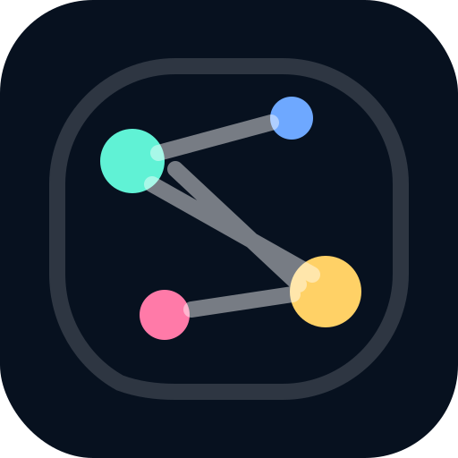
</p>

<h3 align="center">CRM de networking inteligente com visualização em grafo</h3>

<p align="center">
  Organize contatos, descubra relações úteis, encontre oportunidades de introdução e visualize a rede como um mapa vivo.
</p>

<p align="center">
  <a href="https://leninn-marinho-rodrigues.github.io/grafy-cogmo-prototype/"><strong>Abrir protótipo público</strong></a>
  ·
  <a href="docs/guides/product-tour.md">Tour do produto</a>
  ·
  <a href="docs/guides/architecture.md">Arquitetura</a>
  ·
  <a href="docs/guides/demo-script.md">Roteiro de demo</a>
</p>

<p align="center">
  
  
  
  
  
</p>

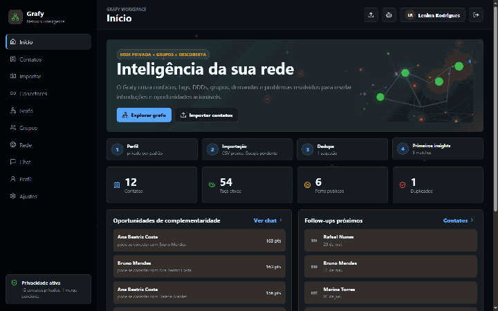

Versão em vídeo curto: [docs/assets/grafy-demo-flow.mp4](docs/assets/grafy-demo-flow.mp4)

## Visão rápida

O Grafy é um protótipo funcional de um produto PWA-first para gestão inteligente de contatos e networking. A proposta é transformar uma lista fria de contatos em uma rede navegável, com pessoas, tags, DDDs, grupos, demandas, problemas resolvidos, fontes de importação e possíveis complementaridades.

Este repositório é uma base de demonstração para conversas internas, validação de produto e evolução técnica. Ele não é ainda a versão final com backend real, mas já entrega a experiência navegável principal do PRD.

## O que dá para testar agora

| Área | O que demonstra |
| --- | --- |
| Landing/onboarding | Entrada central em `#/` perguntando o tipo de negócio, com caminhos dedicados em `#/empresarios` para B2C e `#/hubs-eventos` para B2B/B2B2C. O primeiro acesso agora força a lógica certa: vincular/importar dados reais antes de abrir o workspace. |
| Dashboard | Métricas da base, atalhos, oportunidades e visão geral do workspace. |
| Contatos | CRUD inicial, tags, demandas, problema que resolve, links, grupos e status público/privado. |
| Importação | Google Contacts + Google Agenda quando `VITE_GOOGLE_CLIENT_ID` existe; Apple ID para identidade, Apple Contacts por `.vcf`, Apple Agenda por `.ics`, e bases de hubs por Excel/CSV/JSON. |
| Grafo | Nós de contatos, tags, DDDs/localidade, fontes, grupos, demandas e soluções; pan, zoom, filtros cumulativos e inspetor lateral. |
| Rede pública | Perfis opt-in, cards públicos, filtros e separação clara da base privada. |
| Grupos | Board de pastas/grupos com tags, cores, contatos e impacto visual no grafo para hubs, eventos e empresas. |
| Chat | Busca estruturada por tags, demanda, DDD, problema resolvido, cargo/área e duplicados, com cards ricos. |
| Perfil | Perfil público editável, links sociais, sinais para grafo/chat/Rede e controle de visibilidade. |
| PWA | Manifest, service worker, tela offline e estrutura para instalação mobile. |

## Tour visual

| Escolha inicial | Landing empresários | Landing hubs/eventos |
| --- | --- | --- |
| 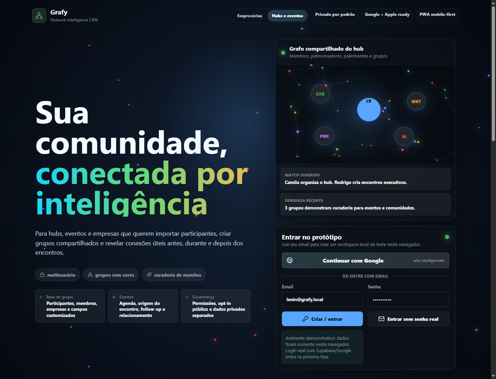 | 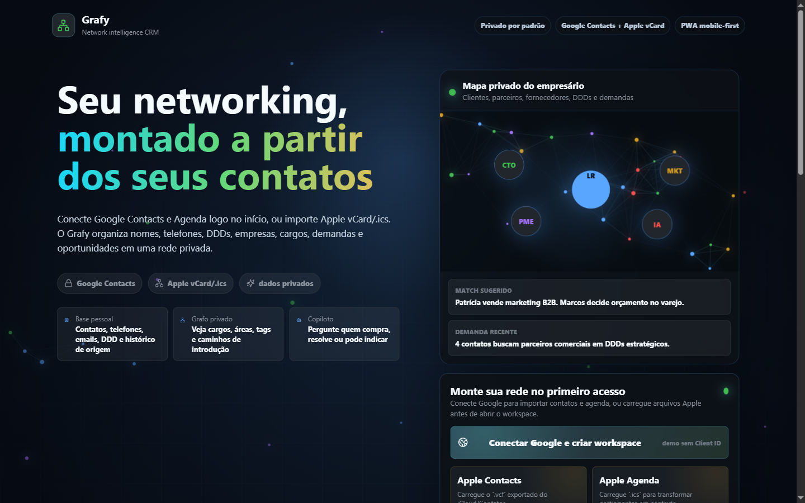 | 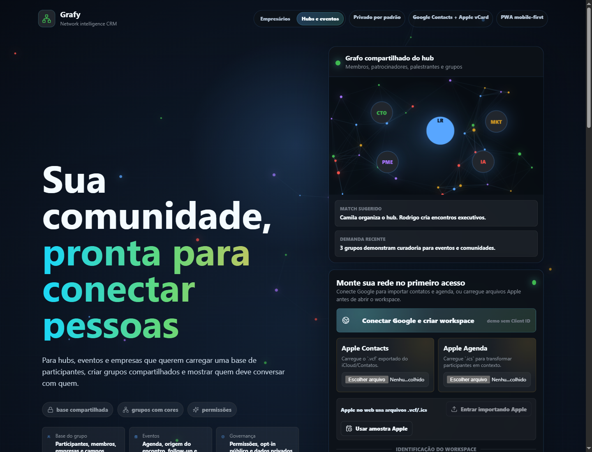 |

| Dashboard | Grafo |
| --- | --- |
| 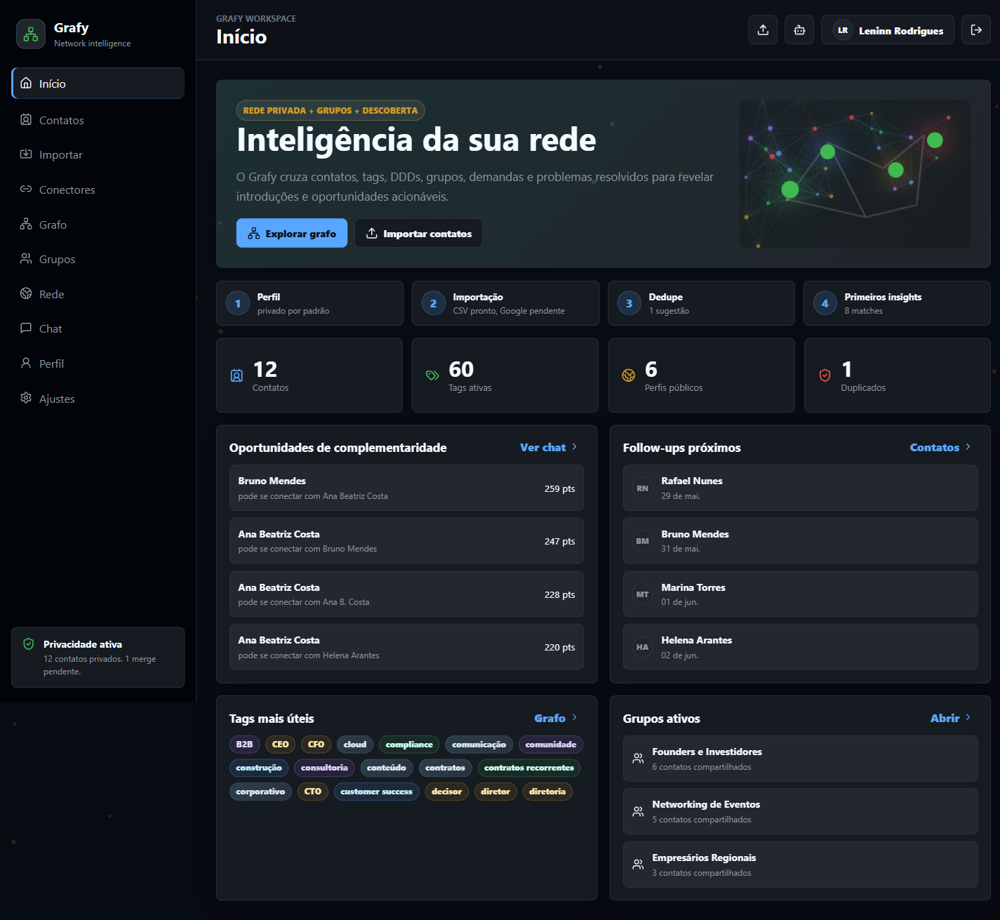 | 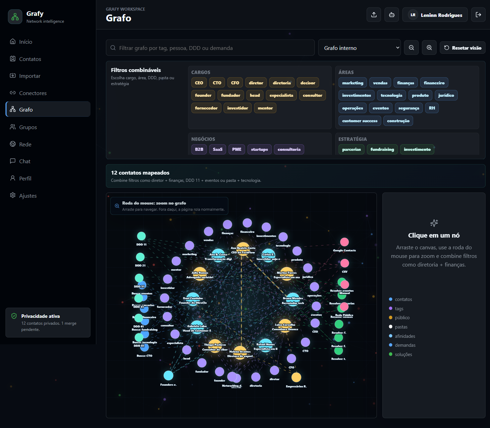 |

| Rede pública | Chat |
| --- | --- |
| 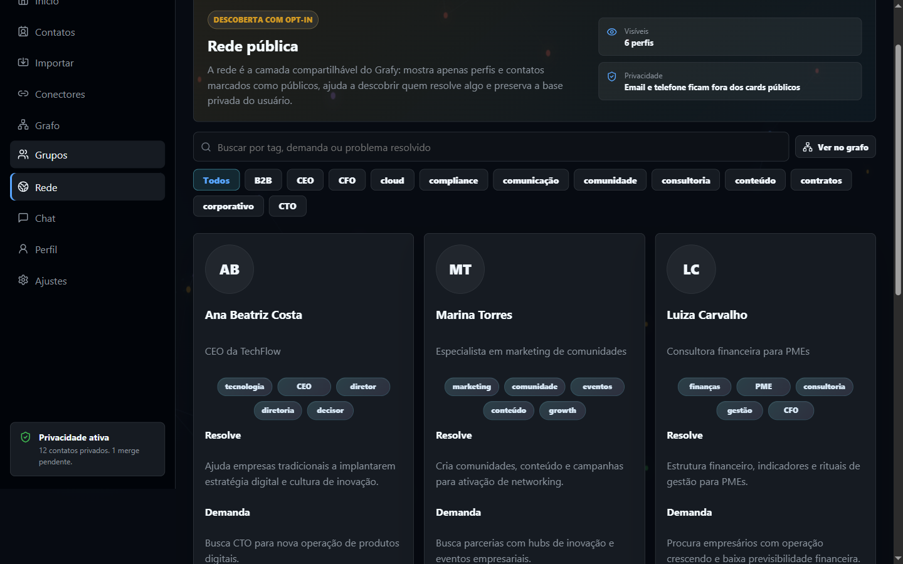 | 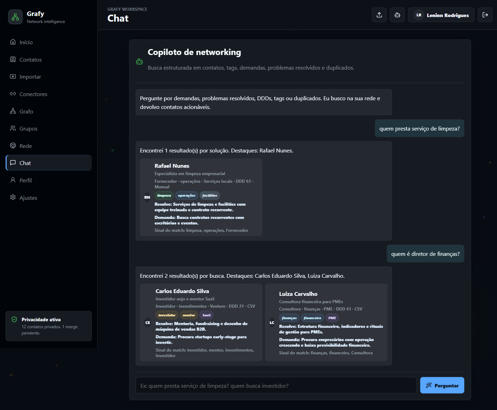 |

| Perfil e visibilidade | Importação Google/Apple |
| --- | --- |
| 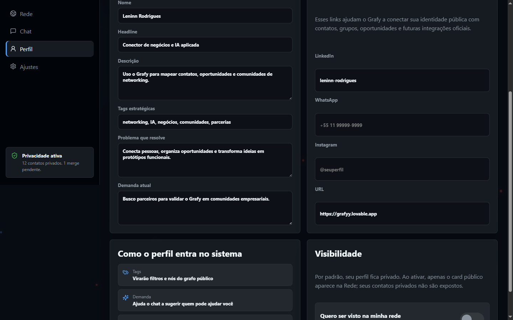 | 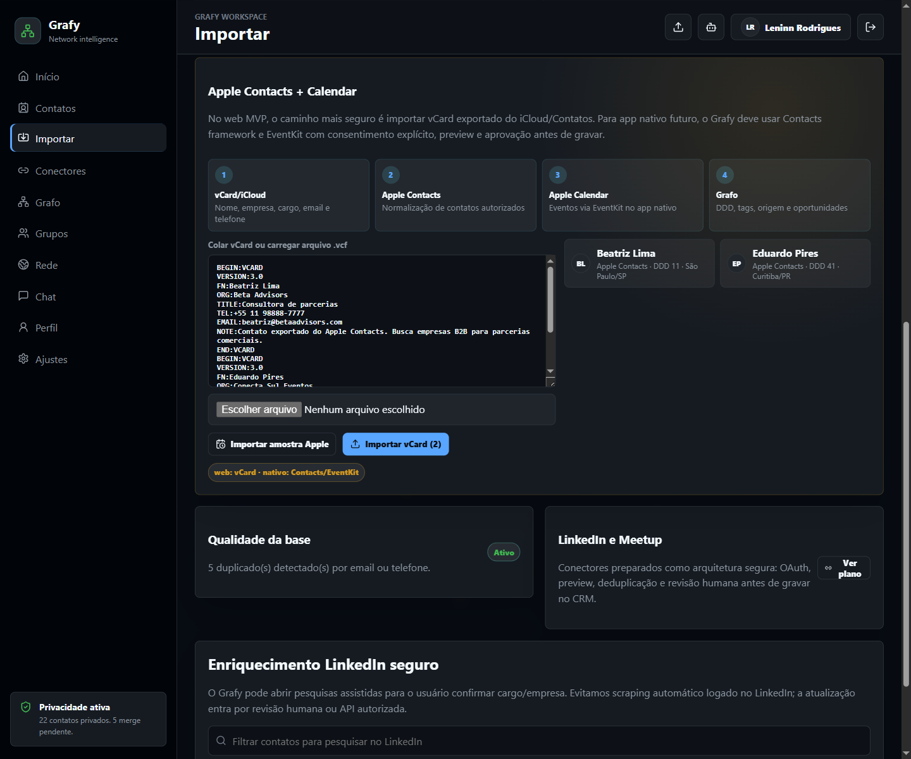 |

| Mobile |
| --- |
| 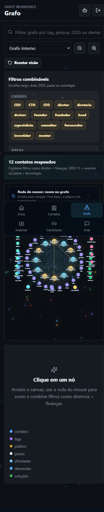 |


## Arquitetura resumida

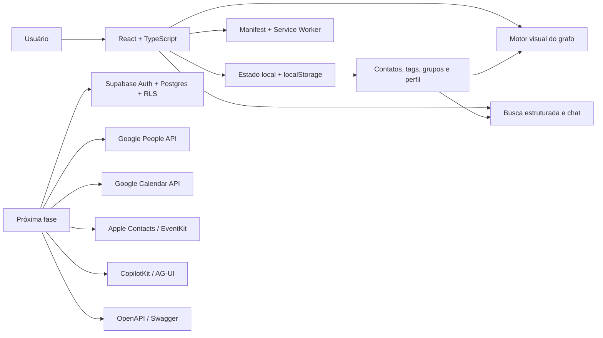

Mais detalhes em [docs/guides/architecture.md](docs/guides/architecture.md).

## Stack

- **Frontend:** React 19, TypeScript, Vite.
- **UI e ícones:** CSS próprio, lucide-react, motion.
- **PWA:** manifest, service worker e página offline.
- **Persistência atual:** localStorage para protótipo demonstrativo.
- **Deploy:** GitHub Pages via GitHub Actions.
- **Evolução recomendada:** Supabase Auth, Postgres com RLS, Google People API, Google Calendar API, Apple Contacts/EventKit para app nativo, OpenAPI/Swagger e copiloto com ferramentas confirmadas.

## Rodando localmente

```bash
npm install
npm run dev -- --port 5173
```

Abra:

```text
http://127.0.0.1:5173/
```

Para validar a build:

```bash
npm run build
npm run preview -- --port 4176
```

## Estrutura do repositório

```text
.
├── src/
│   ├── App.tsx        # Telas, fluxos e composição principal
│   ├── data.ts        # Estrutura inicial, grupos e templates legados
│   ├── lib.ts         # Helpers de busca, tags, grafo e persistência
│   ├── styles.css     # Design system, layout, motion e responsividade
│   └── types.ts       # Contratos TypeScript do domínio
├── public/
│   ├── manifest.json  # PWA
│   ├── sw.js          # Service worker básico
│   └── offline.html   # Fallback offline
├── docs/
│   ├── assets/        # Imagens e GIFs usados na documentação
│   ├── guides/        # Guias curtos para produto, demo e arquitetura
│   └── *.md           # Pesquisa, auditorias e gaps do PRD
└── .github/
    └── workflows/     # Deploy GitHub Pages
```

## Demonstração para colegas

Use o link público e siga o roteiro em [docs/guides/demo-script.md](docs/guides/demo-script.md). A versão publicada é pensada para teste de navegação e apresentação do conceito:

1. Abrir a escolha inicial e selecionar **Empresário** ou **Hub, evento ou empresa**.
2. Para empresário, conectar Google quando o Client ID estiver configurado ou importar Apple `.vcf/.ics`.
3. Para hub/evento/empresa, carregar uma base real em Excel, CSV ou JSON com pessoas, empresa, cargo, área, tags, demanda e solução.
4. Mostrar dashboard, contatos, grafo, grupos, rede pública e chat usando os dados importados.
5. Explicar que os dados ficam no navegador neste protótipo.
6. Apagar dados de teste em **Ajustes** quando necessário.

Links úteis:

- [Escolha inicial](https://leninn-marinho-rodrigues.github.io/grafy-cogmo-prototype/#/)
- [Landing empresários](https://leninn-marinho-rodrigues.github.io/grafy-cogmo-prototype/#/empresarios)
- [Landing hubs, eventos e empresas](https://leninn-marinho-rodrigues.github.io/grafy-cogmo-prototype/#/hubs-eventos)

## Limites importantes

- O login atual ainda é local no protótipo; a experiência já está orientada a conectar/importar dados reais, mas autenticação persistente entra na fase Supabase/Google.
- Dados de teste são persistidos no navegador de cada pessoa, não em um banco compartilhado.
- Google Contacts e Google Calendar tentam OAuth real já no onboarding quando `VITE_GOOGLE_CLIENT_ID` está configurado; sem isso, o protótipo mostra a pendência e não injeta contatos artificiais.
- Sign in with Apple no web resolve identidade, mas não libera a agenda de contatos do iCloud. Por isso, Apple Contacts funciona no web por vCard/.vcf e Apple Agenda por `.ics`; acesso direto exige app nativo ou wrapper mobile com Contacts/EventKit.
- LinkedIn, Meetup, Instagram e X/Twitter aparecem como direção técnica e conectores preparados, não como coleta real em produção.
- Enriquecimento externo deve ser feito com APIs oficiais, consentimento e revisão humana; o sistema não deve depender de scraping logado.

## Próximas fases

1. Ligar Supabase Auth, Postgres, Storage e Row Level Security.
2. Criar migrations para contatos, tags, grupos, campos customizados, perfis públicos, imports e chat.
3. Persistir o conector Google do onboarding com backend seguro, OAuth e Google People API.
4. Persistir Google Agenda via Calendar API para eventos, participantes, origem e follow-up.
5. Manter Apple web por vCard/.ics e adicionar Contacts/EventKit no app nativo quando houver wrapper mobile.
6. Modelar tenants para hubs/eventos/empresas, com membros, imports em lote e permissões.
7. Evoluir o grafo para uma engine especializada quando a base crescer.
8. Adicionar OpenAPI/Swagger e webhooks para integrações.
9. Integrar copiloto com ferramentas de leitura e escrita confirmada.
10. Separar dados de demo, staging e produção.

## Documentação

- [Tour do produto](docs/guides/product-tour.md)
- [Arquitetura e decisões técnicas](docs/guides/architecture.md)
- [Roteiro de demo](docs/guides/demo-script.md)
- [Design system e UX](docs/guides/design-system.md)
- [Checklist das últimas solicitações](docs/guides/execution-checklist-last-requests.md)
- [Auditoria de gaps do PRD](docs/PRD-GAP-AUDIT-2026-05-28.md)
- [Pesquisa de referências](docs/RESEARCH-NETWORK-CRM-INSPIRATION-2026-05-28.md)
- [Pesquisa profunda de apps e bibliotecas](docs/DEEP-RESEARCH-NETWORK-APPS-2026-05-28.md)

## Status

Protótipo funcional publicado para validação interna. O objetivo deste repositório é demonstrar a experiência, organizar o plano técnico e servir como base para a próxima fase de produto.
