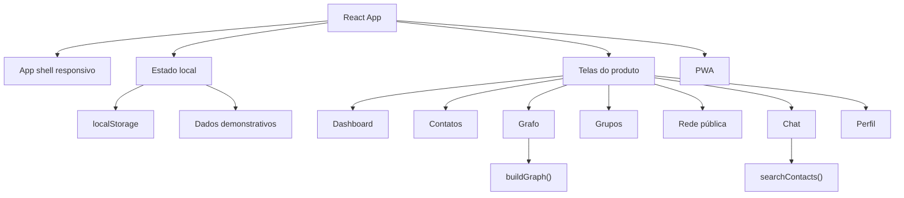
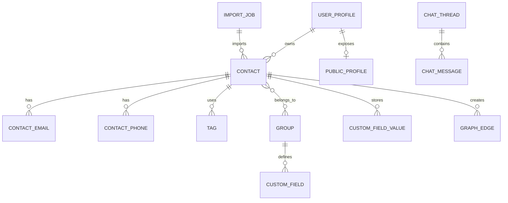
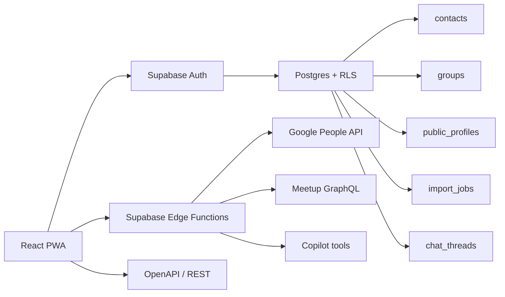

# Arquitetura e Decisões Técnicas

Este documento descreve a arquitetura atual do protótipo e o caminho recomendado para produção.

## Estado atual

O Grafy hoje é um protótipo frontend funcional em React + TypeScript, publicado no GitHub Pages. Ele usa persistência local no navegador para permitir testes rápidos, sem backend.

## Mapa dos arquivos principais

| Arquivo | Papel |
| --- | --- |
| `src/App.tsx` | Composição das telas, fluxos de interação, estado e componentes principais. |
| `src/data.ts` | Dados demonstrativos, contatos, grupos, campos e mensagens iniciais. |
| `src/lib.ts` | Funções de busca, deduplicação, geração do grafo, persistência e helpers. |
| `src/types.ts` | Tipos de domínio: contatos, grupos, perfil, imports, chat e grafo. |
| `src/styles.css` | Design system, layout, responsividade, cards, grafo, animações e PWA visual. |
| `public/manifest.json` | Configuração PWA. |
| `public/sw.js` | Service worker básico. |

## Modelo conceitual de dados

## Fluxo do grafo

1. Os contatos entram por seed, criação manual ou CSV.
2. Tags, DDDs, fontes, grupos, cargos, áreas e tipos de negócio viram dimensões.
3. Demandas e problemas resolvidos também geram nós temáticos.
4. `buildGraph()` transforma essas dimensões em nós e arestas.
5. Afinidades leves conectam pessoas da mesma área, cargo, DDD, tipo de negócio ou pasta.
6. Filtros cumulativos reduzem o escopo e diminuem para 8% a opacidade dos itens fora do foco.
7. O usuário navega com zoom, pan, clique em nó e inspetor lateral.

## Busca e chat

No protótipo, o chat usa busca estruturada local. Ele consulta:

- Nome.
- Tags.
- Descrição.
- Problema que resolve.
- Demanda atual.
- DDD.
- Fonte.
- Sinais de duplicidade.

Consultas com mais de um sinal relevante exigem combinação dos termos, por exemplo `diretor` + `finanças`. Palavras genéricas como "quem", "meus", "contatos" e "serviço" são ignoradas para evitar resultados amplos demais.

Em produção, o mesmo padrão pode virar tools de IA com confirmação antes de editar dados.

## Caminho recomendado para produção

### Backend

- Supabase Auth para Google login e magic link.
- Postgres com Row Level Security.
- Storage para avatars.
- Edge Functions para integrações que exigem tokens.
- OpenAPI/Swagger para parceiros e automações futuras.

### Banco

Entidades recomendadas:

- `user_profiles`
- `contacts`
- `contact_emails`
- `contact_phones`
- `tags`
- `contact_tags`
- `groups`
- `group_members`
- `group_contacts`
- `custom_fields`
- `custom_field_values`
- `public_profiles`
- `merge_suggestions`
- `import_jobs`
- `chat_threads`
- `chat_messages`

### Integrações

- **Google Contacts:** via Google People API, com OAuth e backend seguro.
- **LinkedIn:** usar APIs oficiais aprovadas e/ou pesquisa assistida com revisão humana. Não depender de scraping logado.
- **Meetup:** usar GraphQL/OAuth quando houver token e permissões.
- **Instagram/X:** tratar como conectores futuros de APIs oficiais; não importar rede privada sem consentimento.
- **IA:** CopilotKit/AG-UI com tools de leitura primeiro; escrita somente com confirmação.

## Segurança e privacidade

Regras essenciais para produção:

- Dados privados nunca aparecem na Rede pública sem opt-in.
- Merge de duplicados precisa de aprovação do usuário.
- Integrações externas entram como preview antes de alterar contatos.
- Tokens OAuth ficam no backend, nunca no frontend.
- RLS deve separar dados privados, grupos e perfis públicos.
