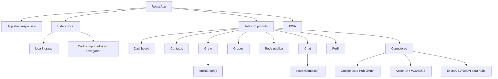
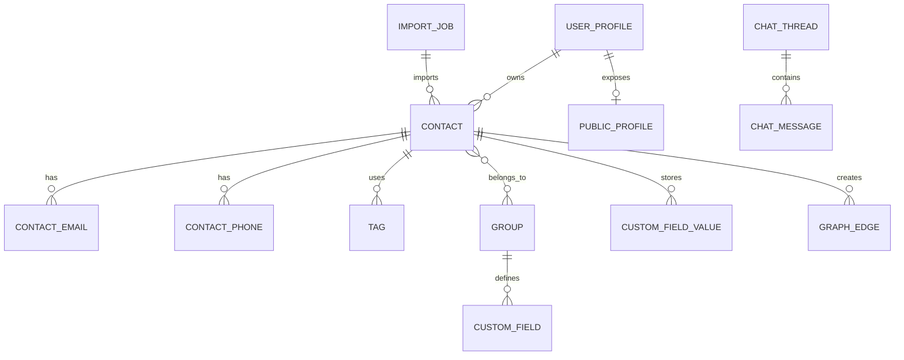
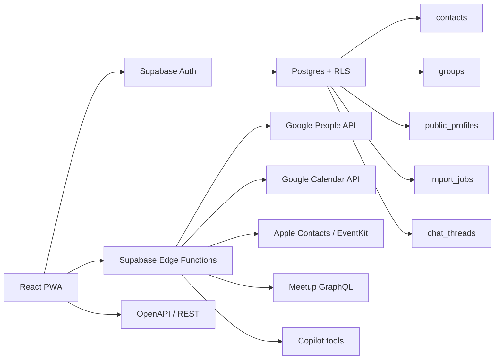

# Arquitetura e Decisões Técnicas

Este documento descreve a arquitetura atual do protótipo e o caminho recomendado para produção.

## Estado atual

O Grafy hoje é um protótipo frontend funcional em React + TypeScript, publicado no GitHub Pages. Ele usa persistência local no navegador para permitir testes rápidos, sem backend.

O protótipo agora demonstra a entrada de dados que o produto precisa ter em produção:

- **B2C:** empresário/conector individual importa Google Contacts, Apple vCard/.ics e agenda própria para achar clientes, fornecedores, parceiros e oportunidades.
- **B2B/B2B2C:** hub, evento, empresa ou comunidade importa Excel, CSV ou JSON com membros/participantes, cria grupos compartilhados e usa o grafo para curadoria de conexões.
- **Onboarding data-first:** a primeira entrada do usuário já pede Google Contacts + Google Agenda, Apple ID + `.vcf/.ics` ou arquivo de hub, para que o workspace abra com contatos reais quando houver consentimento/importação.
- **Google Data Hub:** quando `VITE_GOOGLE_CLIENT_ID` existe, a UI abre OAuth e lê Google People API + Google Calendar API no navegador; em produção, o mesmo fluxo deve passar por backend/Edge Function para guardar tokens com segurança.
- **Apple Contacts + Calendar:** no web, Sign in with Apple não entrega a lista de contatos do iCloud; por isso a UI aceita vCard/.vcf para contatos e `.ics` para agenda. Para app nativo futuro, usar Contacts framework e EventKit.
- **Localidade por DDD:** telefones continuam gerando DDD; o DDD agora também aparece como localidade/região para filtro, grafo, detalhe do contato e chat.

## Mapa dos arquivos principais

| Arquivo | Papel |
| --- | --- |
| `src/App.tsx` | Composição das telas, fluxos de interação, estado e componentes principais. |
| `src/data.ts` | Estrutura inicial, grupos, campos e templates legados separados do fluxo principal. |
| `src/lib.ts` | Funções de busca, deduplicação, geração do grafo, persistência e helpers. |
| `src/types.ts` | Tipos de domínio: contatos, grupos, perfil, imports, chat e grafo. |
| `src/styles.css` | Design system, layout, responsividade, cards, grafo, animações e PWA visual. |
| `public/manifest.json` | Configuração PWA. |
| `public/sw.js` | Service worker básico. |

## Modelo conceitual de dados

## Fluxo do grafo

1. Os contatos entram por Google autorizado, Apple `.vcf/.ics`, Excel/CSV/JSON ou criação manual.
2. Tags, DDDs, fontes, grupos, cargos, áreas e tipos de negócio viram dimensões.
3. Demandas e problemas resolvidos também geram nós temáticos.
4. `buildGraph()` transforma essas dimensões em nós e arestas.
5. Afinidades leves conectam pessoas da mesma área, cargo, DDD, tipo de negócio ou pasta.
6. Filtros cumulativos reduzem o escopo e diminuem para 8% a opacidade dos itens fora do foco.
7. O usuário navega com zoom, pan, clique em nó e inspetor lateral.

## Busca e chat

No protótipo, o chat usa busca estruturada local. Ele consulta:

- Nome.
- Tags.
- Descrição.
- Problema que resolve.
- Demanda atual.
- DDD.
- Fonte.
- Sinais de duplicidade.

Consultas com mais de um sinal relevante exigem combinação dos termos, por exemplo `diretor` + `finanças`. Palavras genéricas como "quem", "meus", "contatos" e "serviço" são ignoradas para evitar resultados amplos demais.

Em produção, o mesmo padrão pode virar tools de IA com confirmação antes de editar dados.

## Caminho recomendado para produção

### Backend

- Supabase Auth para Google login e magic link.
- Postgres com Row Level Security.
- Storage para avatars.
- Edge Functions para integrações que exigem tokens.
- OpenAPI/Swagger para parceiros e automações futuras.
- OAuth incremental: pedir primeiro identidade/login, depois escopo de contatos, depois escopo de agenda quando o usuário acionar essa função.
- Tokens OAuth e refresh tokens ficam em backend/secret vault, nunca em `localStorage`.

### Banco

Entidades recomendadas:

- `user_profiles`
- `contacts`
- `contact_emails`
- `contact_phones`
- `tags`
- `contact_tags`
- `groups`
- `group_members`
- `group_contacts`
- `custom_fields`
- `custom_field_values`
- `public_profiles`
- `merge_suggestions`
- `import_jobs`
- `chat_threads`
- `chat_messages`
- `google_connections`
- `calendar_events`
- `calendar_event_attendees`
- `apple_imports`
- `apple_calendar_events`
- `apple_calendar_attendees`
- `tenant_accounts`
- `tenant_members`
- `tenant_import_batches`

### Integrações

- **Google Contacts:** via Google People API, com OAuth no onboarding, `people.connections.list`, `personFields` mínimos, preview e deduplicação antes de salvar.
- **Google Calendar:** via Calendar API, com `events.list` para eventos autorizados, participantes, origem do encontro, local e follow-up.
- **Apple Contacts:** no web MVP, importar vCard/.vcf exportado do iCloud/Contatos. Em app nativo, usar Contacts framework/CNContactStore com permissão, preview e deduplicação.
- **Apple Calendar:** no web MVP, importar `.ics` exportado da agenda. Em app nativo, usar EventKit para eventos e participantes autorizados.
- **LinkedIn:** usar APIs oficiais aprovadas e/ou pesquisa assistida com revisão humana. Não depender de scraping logado.
- **Meetup:** usar GraphQL/OAuth quando houver token e permissões.
- **Instagram/X:** tratar como conectores futuros de APIs oficiais; não importar rede privada sem consentimento.
- **IA:** CopilotKit/AG-UI com tools de leitura primeiro; escrita somente com confirmação.

### Modelo B2C e B2B

Para produção, a arquitetura deve separar `users` de `tenant_accounts`:

- Usuário B2C possui contatos privados, perfil público opcional, integrações pessoais e grafo privado.
- Hub/evento/empresa possui um tenant, admins, membros, grupos, campos customizados, imports em lote e grafo compartilhado.
- Um mesmo contato pode existir como privado, público e/ou membro de tenant, mas cada vínculo precisa ter permissões e origem rastreáveis.

## Segurança e privacidade

Regras essenciais para produção:

- Dados privados nunca aparecem na Rede pública sem opt-in.
- Merge de duplicados precisa de aprovação do usuário.
- Integrações externas entram como preview antes de alterar contatos.
- Tokens OAuth ficam no backend, nunca no frontend.
- RLS deve separar dados privados, grupos e perfis públicos.
